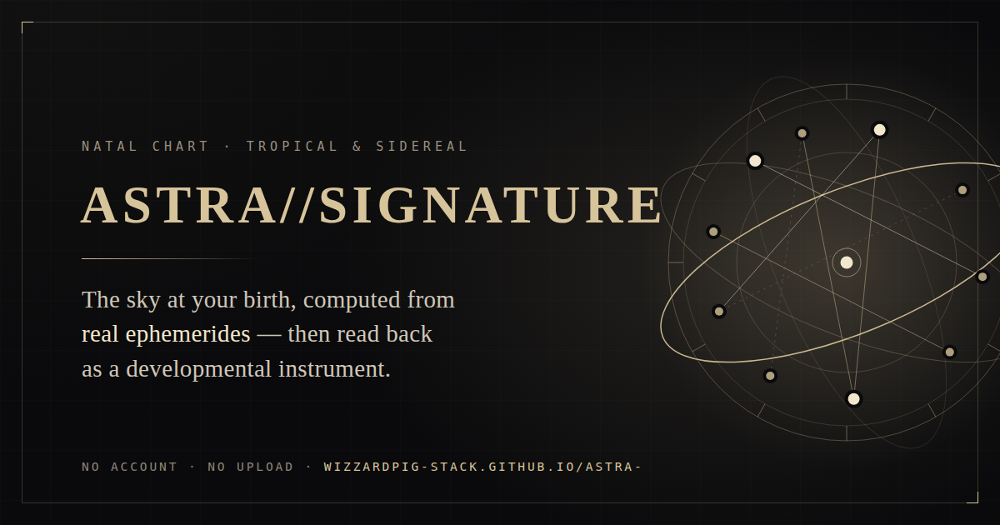

# ASTRA // SIGNATURE

A local-first astrology and developmental interpretation instrument. ASTRA takes
birth data, computes an astronomically derived chart, and presents the result as
an interactive signature rather than a generic horoscope feed.

**→ [wizzardpig-stack.github.io/astra-](https://wizzardpig-stack.github.io/astra-/)**



## What it does

Enter a birth date, time and place. ASTRA computes the sky at that moment and
reads it back through several lenses:

- **Tropical or sidereal** zodiac, with a choice of ayanamsa and nakshatra/pada
  for sidereal charts
- **Placidus, Whole Sign or Equal** houses, with an automatic fall back to Equal
  at latitudes where Placidus is undefined
- Aspects, dignities, major chart figures, and two- and three-body syntheses
- An interactive celestial sphere you can rotate, and an exportable sigil
- Four palettes, and a guided overview of the chart on first resolve

Birth time is optional. Without it, the ascendant and midheaven are omitted and
the reading says so, rather than quietly inventing them.

## Privacy

Everything is computed in the browser. Birth data is held in memory for the life
of the tab: never transmitted, never written to storage. Only display
preferences — palette, lens and view — are kept in `localStorage`.

The page makes no network requests after load; its Content Security Policy sets
`connect-src 'none'`, so that is enforced rather than merely promised. See
[SECURITY.md](SECURITY.md).

## Accuracy

Positions come from standard astronomical series — Meeus solar and lunar theory,
and JPL approximate Keplerian elements for Mercury through Pluto — computed for
the exact moment in UTC and precessed to the date. The engine is accurate for
birth years **1800–2100**, and refuses input outside that range.

Nothing is randomised. The same birth data always produces the same chart.

## Files

| Path | Role |
| --- | --- |
| `index.html` | The instrument. Self-contained: markup, styles and engine in one file. |
| `app.html` | Redirect to the root, kept so links shared before v1.1 still resolve. |
| `assets/` | Social card, icons and favicon. |
| `manifest.webmanifest` | Home-screen install metadata. |
| `404.html` | Styled not-found page for GitHub Pages. |

There is no build step and no dependency to install. Open `index.html`, or serve
the folder over HTTP:

```sh
npx http-server .
```

## Stack

HTML, CSS, vanilla JavaScript and SVG. No framework, no bundler, no backend.

## Moving to a custom domain

Absolute URLs live in four places. Update all of them together:

1. `index.html` — `canonical`, `og:url`, `og:image`, `twitter:image`
2. `sitemap.xml` — `<loc>`
3. `robots.txt` — `Sitemap:`
4. `app.html` and `404.html` — the canonical and return links

Then add a `CNAME` file containing the bare domain, and set it under
**Settings → Pages → Custom domain**.

## Also in this repository

[`specimen/`](specimen/) is a separate product: **SPECIMEN**, a desktop organism
for Windows. It shares nothing with ASTRA but the repository. See
[specimen/README.md](specimen/README.md).

## Status

Public release **v1.1**. Independent product direction, domain framing,
interface design, QA, and AI-assisted implementation.

## Licence

Proprietary — see [LICENSE](LICENSE). The source is published so it can be read
and inspected; that is not a grant to reuse it.

ASTRA is an interpretive and reflective instrument, not medical, psychological,
legal or financial advice.
