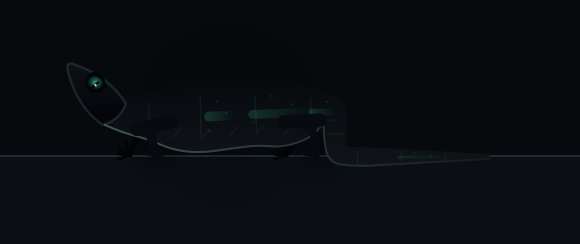
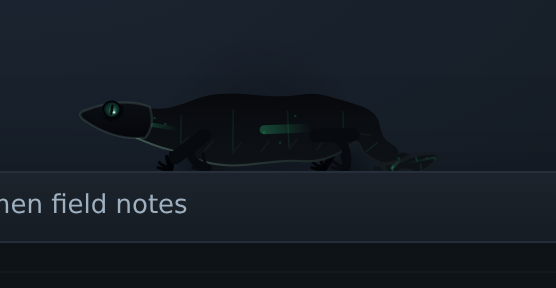

# SPECIMEN

SPECIMEN is software containing an unknown digital organism, **SPEC-01**, that
inhabits the computer rather than a window on it. Windows are surfaces. Screen
edges are terrain. The taskbar is ground. The cursor is something it can notice.

[`docs/PRD-V1.md`](docs/PRD-V1.md) is the source of truth for the product. Where
this implementation and that document disagree, the document wins.



## What this build is

The PRD's **first build target** (§42): *SPEC exists convincingly on the Windows
desktop*, with no memory, no evolution and no INCIDENTS — deliberately. The
instruction is explicit: if the creature is not compelling on its own, adding
intelligence will not save it.

Implemented here:

| PRD §42 | | Where |
| --- | --- | --- |
| 1 | transparent overlay | `src-tauri/src/main.rs` |
| 2 | click passthrough | `src-tauri/src/main.rs`, `overlay/src/main.js` |
| 3 | idle animation | `overlay/src/core/creature.js` |
| 4 | biological crawl | `overlay/src/core/creature.js` |
| 5 | cursor tracking | `overlay/src/core/behavior.js` |
| 6 | walking the bottom screen edge | `overlay/src/core/frames.js` |
| 7 | climbing a detected window edge | `overlay/src/core/terrain.js` |
| 8 | hiding behind that window | `overlay/src/core/behavior.js` |
| 9 | emerging from the opposite side | `overlay/src/core/behavior.js` |
| 10 | stable performance | `overlay/src/main.js` |

Also present: window-geometry awareness and multi-monitor foundation (phase 2),
surface-loss reactions, dragging and throwing, the observer effect in its
simplest form, and the DEV console (§29).

**Not in this build, and not faked:** habitat categories, phenotype weights,
routine learning, prediction, molting, memory scars, the hidden world, INCIDENTS
and the browser extension. Those are phases 3–7. The DEV console lists their
controls as disabled rather than wiring them to nothing.

## Run it without Windows

The organism has no dependency on Windows, or on a build step. Serve the overlay
and it boots a simulated desktop — fake windows you can drag and close, a fake
taskbar — in place of the real one.

```sh
node tools/serve.mjs        # http://127.0.0.1:8099/
```

Add `?dev=1` for the DEV console (it opens automatically on the simulated
desktop), or press `Ctrl+Alt+Shift+D`. Drag a fake window and SPEC rides it;
close one out from under it and SPEC falls.

## Run it on Windows

```sh
npm install
npm run host:dev      # tauri dev
npm run host:build    # tauri build -> NSIS installer
```

Needs the Rust toolchain with the MSVC target, and the WebView2 runtime (present
on Windows 10+ by default). The host process spans every monitor with a
transparent, always-on-top, click-through window, and polls window geometry four
times a second.

> The host has been written against `tauri 2.11` and `windows 0.62`, and its
> dependency graph resolves, but it has not yet been compiled or run on a
> Windows machine — this environment is Linux, and the Tauri toolchain cannot
> build here. Everything above the OS boundary (behaviour, body, rendering,
> navigation) is covered by tests that do run. Treat the Rust layer as
> first-draft until someone runs `npm run host:dev` on real hardware.

## How SPEC knows where it can walk

SPEC's world is not a bitmap. It is a handful of rectangles, each with a side:

* a **display** is a rectangle SPEC is *inside* — floor, walls and ceiling seen
  from within;
* a **window** or the **taskbar** is a rectangle SPEC is *outside* — its top
  edge is a ledge, its sides are walls, its underside is a ceiling it can hang
  from.

A position is one number: arc length clockwise around the perimeter. That makes
corners free (the body is sampled at offsets either side of that number, so it
wraps an edge by construction) and makes escaping the coordinate space
structurally impossible — every attached position is a point on a real edge.
Surfaces are connected by *step*, *jump* and *drop* links, and routes are found
by a search over arrival points, so "walk to the far end of this window and leap"
costs what it actually costs.

Falling is the only free motion: a ballistic body, collision-tested against every
surface, which re-attaches where it lands.



## Hiding is drawn, never done

The overlay is always on top, so SPEC cannot really go behind a window. When it
slips behind one, it attaches to an inset copy of that window's rectangle and the
renderer *erases* the window's area from the overlay afterwards. The real window
is never touched, moved, focused or read. Same mechanism for peeking: half a body
outside the edge, the rest erased.

## Privacy

SPEC's sensory input is the whole of `src-tauri/src/model.rs`: display topology,
window rectangles, window titles and process names, the taskbar rectangle, and
the cursor position. There is no screen capture, no input capture, no file
access, no network access — not as a policy, but as a dependency list. The host
crate pulls in `tauri`, `serde` and `windows`; its Tauri capability grants
`core:default`, `core:event:default` and `core:window:default` and nothing else.

## Layout

```
overlay/            the organism: no build step, no framework, no bundler
  index.html        the transparent surface
  src/main.js       canvas, frame budget, pointer, wiring
  src/core/
    frames.js       rectangles as walkable surfaces; arc positions; raycasts
    terrain.js      desktop snapshot -> surfaces, links, occlusion
    behavior.js     the state machine, navigation, drives
    creature.js     SPEC-01's anatomy, gait, tail, head and eyes
    render.js       obsidian body, subdermal code, contact shadows
    demo.js         the PRD §42 sequence as a script
    dev.js          the DEV console
    rng.js          seeded randomness; the same seed lives the same life
  src/host/
    tauri.js        bridge to the Windows host
    mock.js         simulated desktop for development anywhere
src-tauri/          the Windows host: overlay window, geometry, click-through
tests/              unit tests (node) and the acceptance run (playwright)
docs/PRD-V1.md      the product requirements document
```

## Tests

```sh
npm test                 # 31 unit tests, no dependencies
npm run test:acceptance  # PRD §42 checks in a real browser (needs playwright)
```

The unit tests cover the geometry, the terrain graph, and the invariants that
matter for an organism left alone for a long time: ten simulated minutes per
seed without leaving the desktop or producing a non-finite pose, riding a window
that moves, falling when a surface closes, landing after being thrown, and going
in one side of a window and coming out the other.

The acceptance run drives the actual overlay in Chromium and checks each beat of
the first-build sequence, including that idle is not frozen, that the gait really
steps, and that a resting SPEC costs about **0.1 ms of simulation and 0.25 ms of
drawing per frame**. Items 1 and 2 — transparency and passthrough — live in the
host and cannot be checked from inside the page.

## DEV console

Hidden by default. `?dev=1` or `Ctrl+Alt+Shift+D`.

It forces behaviours that would otherwise need patience (hide, peek, emerge,
fall, throw, sleep, fear, surface loss), exposes the internal model that normal
users must never see — current behaviour, target, surface, observer pressure,
mood, hidden traits, cost per frame — and can record a run and replay it.

## Next

Phase 3 is the Chromium extension: page geometry, video and text regions,
selected text, scroll. Phase 4 is the first memory that survives a restart.
Nothing in phases 4–7 should be started until the creature is right.
